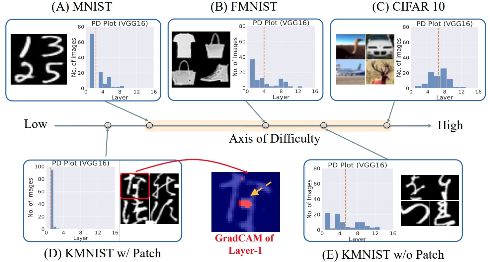

# Beyond Distribution Shift: Spurious Features Through the Lens of Training Dynamics

### [OpenReview](https://openreview.net/forum?id=Tkvmt9nDmB) | [arXiv](https://arxiv.org/abs/2302.09344#:~:text=Deep%20Neural%20Networks%20(DNNs)%20are,applied%20to%20safety%2Dcritical%20domains.) | [Video](https://www.youtube.com/watch?v=kkQ0IKukx5o&ab_channel=NihalMurali) | [Poster](https://pitt-my.sharepoint.com/:b:/g/personal/nim123_pitt_edu/EYh3rVX8nOlKseTkgmx8qiYBQrC7DNpnxfnFJ5d9aJ9m2w?e=d3sVmC) | [Slides](https://pitt-my.sharepoint.com/:p:/r/personal/nim123_pitt_edu/Documents/TMLR23_Dynamics_of_Spurious_Features/TMLR_official_slides(only).pptx?d=w68b380b344094588a317687275dadf39&csf=1&web=1&e=b2M6Wj) | [Talk](https://www.youtube.com/watch?v=6pP8YQX5cmc&ab_channel=ComputationalGenomicsSummerInstituteCGSI)

Official PyTorch implementation of the [TMLR](https://jmlr.org/tmlr/) paper: <br/>
**Beyond Distribution Shift: Spurious Features Through the Lens of Training Dynamics** <br/>
[Nihal Murali<sup>1</sup>](https://scholar.google.co.in/citations?user=LVcXV4oAAAAJ&hl=en),
[Aahlad Puli<sup>3</sup>](https://gatechke.github.io/),
[Ke Yu<sup>1</sup>](https://gatechke.github.io/),
[Rajesh Ranganath<sup>3</sup>](https://gatechke.github.io/),
[Kayhan Batmanghelich<sup>2</sup>](https://www.batman-lab.com/)
<br/>
<sup>1</sup> University of Pittsburgh (ISP), <sup>2</sup> Boston University (ECE), <sup>3</sup> New York University (CS) <br/>

## Table of Contents

1. [Objective](#objective)
2. [Environment setup](#environment-setup)
3. [Downloading data](#downloading-data)
4. [Data Preprocessing](#downloading-data)
5. [Training pipeline](#training-pipleline)
6. [How to Cite](#how-to-cite)
7. [License and copyright](#license-and-copyright)

## Objective

Deep Neural Networks (DNNs) are prone to learning spurious features that correlate with the label during training but are irrelevant to the learning problem. This hurts model
generalization and poses problems when deploying them in safety-critical applications. This paper aims to better understand the effects of spurious features through the lens of the
learning dynamics of the internal neurons during the training process. We make the following observations: (1) While previous works highlight the harmful effects of spurious features on
the generalization ability of DNNs, we emphasize that not all spurious features are harmful. Spurious features can be “benign” or “harmful” depending on whether they are “harder”
or “easier” to learn than the core features for a given model. This definition is model and dataset dependent. (2) We build upon this premise and use instance difficulty methods (like
Prediction Depth (Baldock et al., 2021)) to quantify “easiness” for a given model and to identify this behavior during the training phase. (3) We empirically show that the harmful
spurious features can be detected by observing the learning dynamics of the DNN’s early layers. In other words, easy features learned by the initial layers of a DNN early during the
training can (potentially) hurt model generalization. We verify our claims on medical and vision datasets, both simulated and real, and justify the empirical success of our hypothesis
by showing the theoretical connections between Prediction Depth and information-theoretic concepts like V-usable information (Ethayarajh et al., 2021). Lastly, our experiments show
that monitoring only accuracy during training (as is common in machine learning pipelines) is insufficient to detect spurious features. We, therefore, highlight the need for monitoring
early training dynamics using suitable instance difficulty metrics.

<br/>

## Environment setup

Run the bash commands below to setup the environment having the relevant libraries/packages.

```bash
conda env create --name TMLR23_spurious_dynamics -f environment.yml
conda activate TMLR23_spurious_dynamics
```

## Downloading data

Download the relevant data files from below for which you want to compute Prediction Depth (PD) and detect spurious features.

| Dataset      | URL                                                                                        |
|--------------|--------------------------------------------------------------------------------------------|
| NIH          | [Kaggle Link](https://www.kaggle.com/datasets/nih-chest-xrays/data)                        |        
| MIMIC-CXR    | [PhysioNet portal](https://physionet.org/content/mimic-cxr-jpg/2.0.0/)                     |
| CheXpert     | [Stanford ML Group](https://stanfordmlgroup.github.io/competitions/chexpert/)              |
| GitHub-COVID | [covid-chestxray-dataset GitHub](https://github.com/ieee8023/covid-chestxray-dataset)      |

## Data Preprocessing

PD computation requires running a k-Nearest Neighbor classifier (between the input image and training data) on the intermediate layers of the model. To get the embeddings at each layer which serves as the training data for the k-NN we need a subset of training data given below. The subset must have equal number of positives and negatives.

| Link  | Description                        |
|-----------|------------------------------------|
| [nih_full.csv](https://pitt-my.sharepoint.com/:x:/r/personal/nim123_pitt_edu/Documents/TMLR23_Dynamics_of_Spurious_Features/nih.csv?d=w1a6197caae734b35a9d2799032609cc9&csf=1&web=1&e=onM8L0)  | NIH full data (see Fig-8)    | 
| [nih_subset.csv](https://pitt-my.sharepoint.com/:x:/r/personal/nim123_pitt_edu/Documents/TMLR23_Dynamics_of_Spurious_Features/nih_subset.csv?d=we9276741f6494387bc3e773d6cd1c7f0&csf=1&web=1&e=sMPUaV)  | NIH (subset): train embeddings for k-NN PD computations (see Fig-8)   | 
| [chex_mimic_full.csv](https://pitt-my.sharepoint.com/:x:/r/personal/nim123_pitt_edu/Documents/TMLR23_Dynamics_of_Spurious_Features/ChexMIMIC_full.csv?d=w69c4f221c1e1496c989e9b4129fea7ad&csf=1&web=1&e=76BqCL)  | Chex-MIMIC full data (see Fig-7a)    | 
| [chex_mimic_subset.csv](https://pitt-my.sharepoint.com/:x:/r/personal/nim123_pitt_edu/Documents/TMLR23_Dynamics_of_Spurious_Features/ChexMIMIC_subset.csv?d=w9b791d22c11e425598b3612c83bdedea&csf=1&web=1&e=hwWe3l)  | Chex-MIMIC (subset): train embeddings for k-NN PD computations (see Fig-7a)| 
| [covid_full.csv](https://pitt-my.sharepoint.com/:x:/r/personal/nim123_pitt_edu/Documents/TMLR23_Dynamics_of_Spurious_Features/covid_full.csv?d=w42617bb1874d4c8db0a22e962beef6eb&csf=1&web=1&e=F6dUGE)  | Covid full data (see Fig-7b)   | 
| [covid_subset.csv](https://pitt-my.sharepoint.com/:x:/r/personal/nim123_pitt_edu/Documents/TMLR23_Dynamics_of_Spurious_Features/covid_subset.csv?d=wd22a0304f42b42518a31796a6a847997&csf=1&web=1&e=B7PetJ)  | Covid (subset): train embeddings for k-NN PD computations (see Fig-7b)  | 

## Training pipeline

1. See the example config file in [./configs/nih.yaml](/configs/nih.yaml). Replace the data_file with path to <dataset_name>_full.csv file above, and change the other variables as appropriate.

Run the below command to train a densenet-121 model on the above dataset. Make sure to set in right values for the arguments

```bash
python ./scripts/train_densenet.py --main_dir <path/to/repo> 
```

2. Analyse the checkpoint using PD plots

```bash
python ./scripts/analyse_ckpt.py --main_dir <path/to/repo> --expt_name nih-analysis --ckpt_path </path/to/checkpoint> --csv_train_embs </path/to/dataset_subset.csv> --csv_plot_pd </path/to/test/images/for/PD_plot>
```

The PD plot is saved as ./output/<expt_name>_pd_plot.svg"

3. Analyse the peaks in PD plot with Grad-CAM 

Follow the steps in the [./notebooks/pd_analysis.ipynb](/notebooks/pd_analysis.ipynb) script

## Other Experiments

1. Dominoes Experiments (see Fig-5 and Table-1 in Main Paper)

a. Follow data-generation steps as outlined in: [./notebooks/domino_generation.ipynb](/notebooks/domino_generation.ipynb)
b. Train models on domino-datasets by following steps in: [./notebooks/domino_training.ipynb](/notebooks/domino_training.ipynb)

2. Not all spurious features hurt generalization! (Toy data expts shown in Fig-6)

The [./notebooks/toy_data_expts.ipynb](/notebooks/toy_data_expts.ipynb) notebook has all the steps: data generation, model training, pd plots, gradCAM/shap analysis

3. PD/PVI correlation (see Table-2)

Follow the simple steps in []()

## How to Cite
* TMLR23 Main Paper
```
@article{murali2023shortcut,
  title={Shortcut Learning Through the Lens of Early Training Dynamics},
  author={Murali, Nihal and Puli, Aahlad Manas and Yu, Ke and Ranganath, Rajesh and Batmanghelich, Kayhan},
  journal={arXiv preprint arXiv:2302.09344},
  year={2023}
}
```

* Shortcut paper published in Workshop on Spurious Correlations, Invariance and Stability, ICML 2023
```
@article{muralishortcut,
  title={Shortcut Learning Through the Lens of Training Dynamics},
  author={Murali, Nihal and Puli, Aahlad Manas and Yu, Ke and Ranganath, Rajesh and Batmanghelich, Kayhan}
}
```

## License and copyright

Licensed under the [MIT License](LICENSE)

Copyright © [Batman Lab](https://www.batman-lab.com/), 2023

